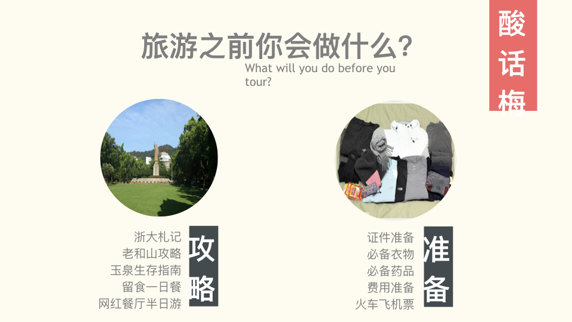
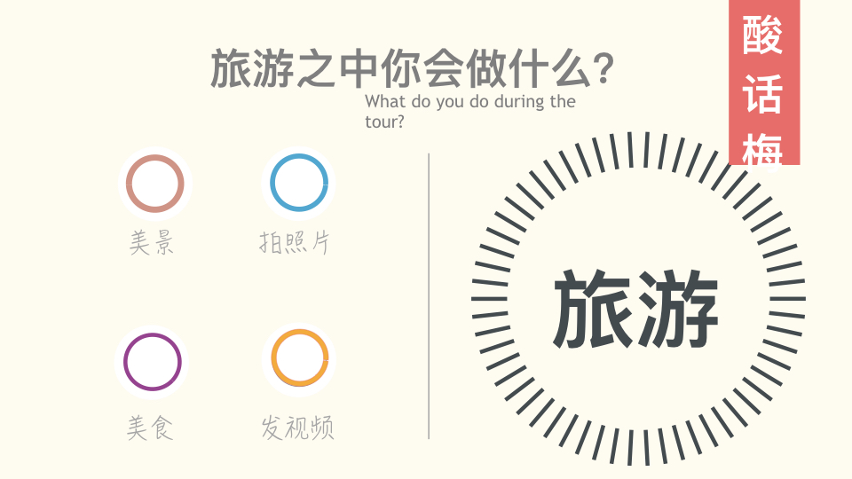
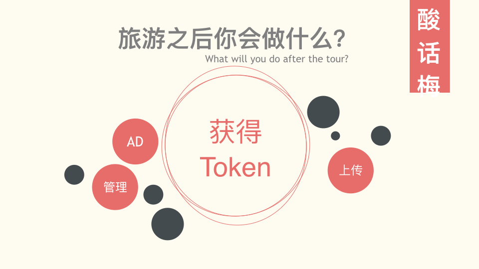

# 酸话梅 -- 有图有世界

<!-- TOC -->

- [1. 项目简介](#1-项目简介)
- [2. 具体规则](#2-具体规则)
    - [2.1. 激励用户上传图片](#21-激励用户上传图片)
    - [2.2. Token 的使用](#22-token-的使用)

<!-- /TOC -->

## 1. 项目简介
这是一款旅游的预体验产品。用户上传景点照片，获得Token 奖励，系统利用用户上传的图片，通过三维重建技术，合成一个360度全景展示。用户可以通过支付Token获取合成的近乎现实的VR实景，来预先体验景点，以获得先验性的评价。

## 2. 具体规则

### 2.1. 激励用户上传图片

基础Token奖励：符合上传标准（清晰度、相关联性、原创性等）即可获得。 

附加Token奖励：根据图片质量、可用性、缺失情况等因素额外给予奖励。

### 2.2. Token 的使用

利用用户上传的原始图片素材，结合三维重建，实现景点的360全景展现，打造一个近乎身临其境的产品。

用户可以通过花费Token来观看全景图。全景的收费主要依据VR本身的质量、市场需求度、历史评价等因素。

